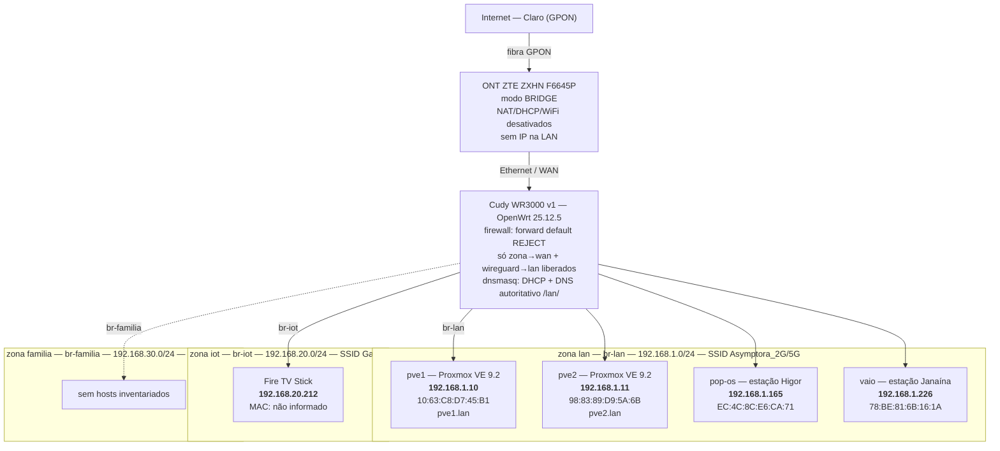

# Rede Asymptora — Topologia e Endereçamento

**Repositório:** `asymptora-tech/infra` · **Caminho sugerido:** `docs/network/topology-and-addressing.md`
**Levantamento:** 2026-08-22 17:22 −03 · **Estação de origem:** `pop-os.lan` (192.168.1.165)
**Estado:** Três redes WiFi segregadas (`lan` / `iot` / `familia`), cada uma com bridge L2 e
zona de firewall dedicadas. Sem VLANs 802.1Q — desnecessárias neste desenho (§2.4).
Reservas e nomes DNS de `pve1`/`pve2` configurados e verificados em 2026-08-22 (§4.1, §6, §7).
O levantamento completo (via `nmap`) cobre apenas a rede `lan` (Asymptora, `192.168.1.0/24`);
na zona `iot` (Gaiola, `192.168.20.0/24`) há um host confirmado (Fire TV Stick,
`192.168.20.212`); a zona `familia` ainda não tem inventário de dispositivos.

---

## 1. Escopo e método

Documento de linha de base (*baseline*) da rede doméstica, atualizado após a introdução de
reservas DHCP e nomes DNS estáticos na zona `lan`. Todos os dados de endereçamento abaixo são
observados, não presumidos. Comandos usados:

| Comando | O que estabeleceu |
|---|---|
| `dig asymptora.com` | Resolução via `systemd-resolved` (127.0.0.53) → 173 ms, sem cache |
| `dig @192.168.1.1 asymptora.com` | O Cudy responde DNS na porta 53 (dnsmasq) → 3 ms, resposta em cache |
| `ip neigh` | Gateway 192.168.1.1 alcançável em `wlo1`; MAC `80:af:ca:7f:59:83`; roteador IPv6 ativo |
| `sudo nmap -sn 192.168.1.0/24` | Descoberta de 5 hosts ativos e seus MACs na rede `lan` |
| `ip addr` | Endereçamento da própria estação (IPv4 dinâmico, lease de ~11,6 h; IPv6 ULA + GUA) |
| `uci show dhcp` / `uci export dhcp` | Estado declarado da configuração de DHCP/DNS no Cudy |
| `logread` com `option logqueries '1'` | Fonte de cada resposta DNS (`config` / `cached` / `forwarded`) — base do diagnóstico de §7 |

IP do Fire TV Stick (`192.168.20.212`, zona `iot`) confirmado por verificação direta no
dispositivo — fora do escopo do `nmap -sn` acima, que cobriu apenas `192.168.1.0/24`.

Prefixos IPv6 observados: ULA `fd22:72a1:5898::/48` e GUA `2804:14c:5b30:80f8::/64`
(delegado pelo ISP). O gateway IPv6 é o mesmo Cudy (`fd22:72a1:5898::1`).

### 1.1 Glossário — domínio de busca local

No bloco `config dnsmasq` do `/etc/config/dhcp`:

| Diretiva | Função |
|---|---|
| `option domain 'lan'` | Define o domínio local da rede. É o sufixo aplicado a nomes internos — a razão de `pve1.lan` ser o nome resolvível. |
| `option local '/lan/'` | Instrui o dnsmasq a tratar `/lan/` como zona autoritativa local: consultas terminadas em `.lan` **nunca** são encaminhadas aos servidores externos (`list server '1.1.1.1'` / `'8.8.8.8'` do mesmo bloco). Se o nome não existir localmente, a resposta é `NXDOMAIN` autoritativo, não uma consulta vazando para a internet. |
| `option expandhosts '1'` | Faz o dnsmasq acrescentar o domínio local a nomes sem sufixo, permitindo que entradas registradas como `pve1` respondam como `pve1.lan`. |

É essa combinação que separa nomes internos de consultas que devem sair para o mundo. Sem
`local`/`domain`, uma consulta a `pve1.lan` seria encaminhada ao resolvedor externo — que
responderia `NXDOMAIN` por motivo completamente diferente, dificultando o diagnóstico.

---

## 2. Segregação de rede

### 2.1 As três redes

| Rede (SSID) | Bridge | Sub-rede | Zona firewall |
|---|---|---|---|
| Asymptora_2G / Asymptora_5G | `br-lan` | `192.168.1.0/24` | `lan` |
| Gaiola | `br-iot` | `192.168.20.0/24` | `iot` |
| Yaguara | `br-familia` | `192.168.30.0/24` | `familia` |

Cada SSID é uma interface virtual própria no driver WiFi, associada via `option network`
diretamente à bridge da sua zona. Não há trunk nem porta física compartilhada entre as três
bridges.

### 2.2 Isolamento — Camada 2 (Ethernet/broadcast)

Cada bridge é um domínio de broadcast distinto. Um dispositivo em `Yaguara` nunca recebe um
frame originado em `Asymptora` ou `Gaiola` — não por regra, mas porque, do ponto de vista do
kernel, não existe caminho L2 entre elas. ARP spoofing e ataques de camada 2 entre redes são
estruturalmente impossíveis, não apenas bloqueados.

### 2.3 Isolamento — Camada 3 (roteamento/IP)

O firewall opera em modo *default-deny* (`option forward 'REJECT'` nos defaults). O
`config forwarding` só abre três vias: `lan→wan`, `iot→wan`, `familia→wan`, mais
`wireguard→lan` para acesso remoto. Não existe entrada `iot→lan`, `iot→familia`,
`familia→lan` ou qualquer combinação cruzada entre as três redes internas. Cada zona `iot`
e `familia` tem `input REJECT`, com exceção pontual liberando DHCP/DNS (portas 53/67/68)
apenas contra o próprio roteador — necessário para essas redes funcionarem, sem abrir acesso
a outras zonas.

Resultado: as três redes só conseguem alcançar a internet (WAN) e nada mais. Nenhuma enxerga
ou é alcançada pelas outras, em nenhuma camada.

### 2.4 Justificativa de desenho (bridges dedicadas vs. VLAN 802.1Q)

WiFi tem uma propriedade que rede cabeada não tem: qualquer pessoa dentro do alcance do
sinal é, potencialmente, um dispositivo na rede, bastando a senha. Isso muda o modelo de
ameaça — visitantes, dispositivos IoT de terceiros, e qualquer coisa que entre na rede errada
por engano ou má-fé, precisam estar contidos por padrão.

Separar por bridges L2 nativas (em vez de VLANs 802.1Q sobre uma bridge única) é a opção
adotada aqui especificamente porque não há switch gerenciado a jusante recebendo múltiplas
SSIDs por um cabo trunk — todo o tráfego nasce e morre dentro do próprio roteador. Nesse
cenário, VLAN tagging adicionaria uma camada de abstração (tags, PVID, portas
tagged/untagged) sem ganho adicional de isolamento: o isolamento por bridges dedicadas
entrega a mesma garantia de segregação, com configuração mais direta e menos superfície para
erro (uma porta esquecida como *untagged* na VLAN errada é a causa clássica de vazamento
entre VLANs — aqui essa classe de erro não existe porque não há tagging).

A combinação com firewall *default-deny* fecha o modelo: mesmo que o isolamento L2 falhasse
por algum motivo não previsto, o roteamento IP entre as três redes já está bloqueado por
ausência de regra — não por uma regra de exceção que poderia ser mal configurada. Cada rede
sem fio só fala com a internet, e ponto.

---

## 3. Diagrama de topologia

### 3.1 Versão ASCII (legível em terminal e em `cat`)

```text
                        ┌───────────────────────────────┐
                        │   Internet — Claro (GPON)     │
                        └───────────────┬───────────────┘
                                        │ fibra óptica
                                        ▼
        ┌───────────────────────────────────────────────────────────┐
        │  ONT  ZTE ZXHN F6645P                                     │
        │  Firmware V2.0.12P1N8                                     │
        │  MODO: BRIDGE  —  NAT ✗   DHCP ✗   WiFi ✗   Roteamento ✗  │
        │  Sem endereço na LAN: encapsula/desencapsula apenas       │
        └───────────────────────────────┬───────────────────────────┘
                                        │ Ethernet → porta WAN (1 GbE)
                                        ▼
        ┌───────────────────────────────────────────────────────────┐
        │  ROTEADOR  Cudy WR3000 v1  —  OpenWrt 25.12.5             │
        │  MAC (br-lan) ..... 80:AF:CA:7F:59:83                     │
        │  Hostname .......... OpenWrt.lan                          │
        │  firewall: forward default REJECT · só zona→wan liberado  │
        │  wireguard→lan liberado para acesso remoto                │
        │  dnsmasq: DHCP + DNS autoritativo para /lan/              │
        └───┬───────────────────────┬───────────────────────┬───────┘
            │ br-lan                │ br-iot                │ br-familia
            │ zona: lan             │ zona: iot              │ zona: familia
            │ 192.168.1.0/24        │ 192.168.20.0/24        │ 192.168.30.0/24
            │ SSID: Asymptora_2G/5G │ SSID: Gaiola            │ SSID: Yaguara
            ▼                       ▼                        ▼
  ┌─────────────────────┐   ┌────────────────────┐   ┌───────────────────┐
  │ gateway 192.168.1.1 │   │ gateway 192.168.20.1│   │ gateway 192.168.30.1│
  └─────────┬────────────┘   └─────────┬───────────┘   └─────────┬──────────┘
            │                          │                          │
  ┌─────────┴──────────┬──────────┬────┴────┐                (nenhum host
  ▼                     ▼          ▼         ▼                 inventariado
┌──────────┐ ┌──────────┐ ┌──────────────┐ ┌──────────────┐    ainda)
│ pve1     │ │ pve2     │ │ pop-os       │ │ vaio         │  ┌──────────────┐
│ Proxmox  │ │ Proxmox  │ │ (Higor)      │ │ (Janaína)    │  │ Fire TV Stick│
│192.168   │ │192.168   │ │192.168.1.165 │ │192.168.1.226 │  │192.168.20.212│
│  .1.10   │ │  .1.11   │ │              │ │              │  │ MAC: n/d     │
│10:63:C8: │ │98:83:89: │ │EC:4C:8C:     │ │78:BE:81:     │  └──────────────┘
│ D7:45:B1 │ │ D9:5A:6B │ │  E6:CA:71    │ │  6B:16:1A    │
│pve1.lan  │ │pve2.lan  │ │              │ │              │
└──────────┘ └──────────┘ └──────────────┘ └──────────────┘

Isolamento: br-lan, br-iot e br-familia são domínios L2 distintos — não existe caminho de
broadcast entre elas. No roteamento IP, só lan→wan, iot→wan, familia→wan e wireguard→lan
são permitidos; qualquer combinação cruzada entre lan/iot/familia é REJECT por ausência de
regra.

Fora do inventário ativo no scan da zona lan (não responderam ao nmap -sn):
  · 2× celulares Samsung Android
Zona iot: 1 host confirmado (Fire TV Stick, 192.168.20.212) — demais dispositivos, se houver,
não inventariados. Zona familia: sem levantamento de hosts realizado até o momento.
```

### 3.2 Versão Mermaid (renderiza nativamente no GitHub)



---

## 4. Tabela de endereçamento

> Escopo: zona `lan` (`192.168.1.0/24`, SSID Asymptora_2G/5G) tem levantamento completo via
> `nmap`. Zona `iot` (`192.168.20.0/24`, SSID Gaiola) tem um host confirmado (Fire TV Stick).
> Zona `familia` (`192.168.30.0/24`, SSID Yaguara) ainda não tem inventário.

### 4.1 Hosts ativos na zona `lan` (observados em 2026-08-22)

| # | Dispositivo | Hostname | Zona | Papel | IPv4 | MAC | OUI (nmap) | Atribuição — hoje |
|---|---|---|---|---|---|---|---|---|
| 1 | Cudy WR3000 v1 | `OpenWrt.lan` | `lan` (gateway de todas as zonas) | Gateway, NAT, DHCP, DNS, firewall, AP | `192.168.1.1` | `80:AF:CA:7F:59:83` | *desconhecido* | **Estático** — IP de interface em `/etc/config/network` (`br-lan`) |
| 2 | Samsung E30 #1 | `pve1` / `pve1.lan` | `lan` | Hipervisor Proxmox VE 9.2 | `192.168.1.10` | `10:63:C8:D7:45:B1` | Liteon Technology | **Três mecanismos (2026-08-22):** (i) **estático no host** — `nic1 inet static` em `/etc/network/interfaces`, fonte real do endereço; (ii) **reserva DHCP registrada** — `config host` no Cudy, impede o pool dinâmico de ofertar `.10` a outro cliente; (iii) **nome DNS estático** — `config domain`, publica `pve1.lan` independentemente de lease (ver §7) |
| 3 | Samsung E30 #2 | `pve2` / `pve2.lan` | `lan` | Hipervisor Proxmox VE 9.2 | `192.168.1.11` | `98:83:89:D9:5A:6B` | Samsung Electronics | **Três mecanismos (2026-08-22):** (i) **estático no host** — `nic1 inet static` em `/etc/network/interfaces`, fonte real do endereço; (ii) **reserva DHCP registrada** — `config host` no Cudy, impede o pool dinâmico de ofertar `.11` a outro cliente; (iii) **nome DNS estático** — `config domain`, publica `pve2.lan` independentemente de lease (ver §7) |
| 4 | Asus VivoBook X1504VA | `pop-os.lan` | `lan` | Estação de trabalho (Higor) | `192.168.1.165` | `EC:4C:8C:E6:CA:71` | *n/d — host local* | **Dinâmico** via pool DHCP (lease 12 h) |
| 5 | Vaio FE16 | *(não resolvido)* | `lan` | Estação de trabalho (Janaína) | `192.168.1.226` | `78:BE:81:6B:16:1A` | *desconhecido* | **Dinâmico** via pool DHCP |

> Os três mecanismos das linhas 2 e 3 são independentes e cumprem funções distintas. Registrar
> apenas "reserva DHCP" seria impreciso: a reserva não é a fonte do endereço (o host é), e não
> é o que resolve o nome (o `config domain` é). Ver §7 para a evidência que estabeleceu isso.
>
> O MAC do host #4 veio de `ip addr` (interface `wlo1`), não do `nmap`: o scan não exibe o
> endereço de camada 2 da própria máquina que executa a varredura.
> O hostname do host #5 não foi resolvido pelo dnsmasq — o cliente provavelmente não envia
> a opção 12 (*hostname*) no DHCPDISCOVER.

### 4.2 Hosts confirmados na zona `iot`

| # | Dispositivo | Hostname | Zona | Papel | IPv4 | MAC | Atribuição — hoje |
|---|---|---|---|---|---|---|---|
| 6 | Amazon Fire TV Stick | *(não informado)* | `iot` | Cliente de streaming | `192.168.20.212` | *não informado* | **A confirmar** — origem do IP (DHCP dinâmico ou fixo no dispositivo) não verificada |

> IP confirmado por verificação direta no dispositivo, fora do escopo do `nmap -sn` já
> executado (que cobriu apenas `192.168.1.0/24`). MAC e forma de atribuição (lease DHCP em
> `192.168.20.0/24` vs. IP fixo configurado no Fire TV) ainda não foram levantados — para
> confirmar, rodar `sudo nmap -sn 192.168.20.0/24` a partir de um host associado ao SSID
> Gaiola, ou consultar `cat /tmp/dhcp.leases` no Cudy filtrando pela interface `br-iot`.

### 4.3 Plano de numeração da zona `lan` (`192.168.1.0/24`)

| Faixa | Uso | Mecanismo |
|---|---|---|
| `192.168.1.1` | Gateway / roteador | IP de interface, estático |
| `192.168.1.2` – `192.168.1.9` | Reservado — infraestrutura de rede futura (switch gerenciado, AP adicional) | — |
| `192.168.1.10` – `192.168.1.49` | Infraestrutura do homelab (hipervisores, VMs e LXC com IP fixo) | Estático no host + reserva DHCP + `config domain` |
| `192.168.1.50` – `192.168.1.99` | Reservado — serviços futuros (PostgreSQL, Kafka, Redis, k3s — fases F5/F10/F11) | Reserva DHCP estática |
| `192.168.1.100` – `192.168.1.249` | Pool DHCP dinâmico (padrão OpenWrt: `start=100`, `limit=150`) | Dinâmico |
| `192.168.1.250` – `192.168.1.254` | Reservado — testes e dispositivos efêmeros | — |

**Ocupação atual da faixa de infraestrutura:** `pve1 → 192.168.1.10`, `pve2 → 192.168.1.11`.

Planos de numeração para `192.168.20.0/24` (iot) e `192.168.30.0/24` (familia) ainda não
foram definidos — entram neste documento quando o inventário de hosts nessas zonas estiver
completo (§4.2 já registra o primeiro host confirmado em `iot`).

---

## 5. Observações de engenharia

### 5.1 `pve1` e `pve2` não estão no pool DHCP — confirmado

O pool DHCP da zona `lan` é `192.168.1.100`–`192.168.1.249`. Os endereços `.10` e `.11` estão
abaixo dessa faixa. `cat /etc/network/interfaces` em ambos os hipervisores confirmou
`iface nic1 inet static` com os endereços fixados localmente, e `cat /tmp/dhcp.leases` no Cudy
não exibe entrada para nenhum dos dois — nem antes nem depois da criação das reservas.

Decisão adotada: **opção A** — manter o endereço estático no host e registrar a reserva no
Cudy assim mesmo. O hipervisor não depende de serviço externo para ter endereço no boot, e a
reserva impede o dnsmasq de ofertar `.10`/`.11` a outro cliente.

Consequência que só ficou visível depois: a reserva sozinha não publica o nome em DNS. Ver §7.

### 5.2 DNS local operante

`dig @192.168.1.1` responde em 3 ms contra 173 ms do caminho externo: o dnsmasq do Cudy
funciona como cache recursivo e, para `/lan/`, como servidor autoritativo (§1.1). Nomes
internos `pve1.lan` e `pve2.lan` estão publicados, dispensando `/etc/hosts` replicado por
máquina.

### 5.3 IPv6 está ativo e não é coberto por este documento

A rede tem ULA (`fd22:72a1:5898::/48`) e GUA delegado (`2804:14c:5b30:80f8::/64`) com
endereços temporários (privacy extensions) rotacionando. Reserva DHCP é um mecanismo IPv4;
o equivalente IPv6 é DHCPv6 com DUID ou endereçamento estático. Fica registrado como pendência
— relevante quando houver serviços publicados.

### 5.4 Limitações conhecidas do levantamento

- `nmap -sn` só enxerga hosts que respondem a ARP/ICMP **e** estão ligados. Os celulares
  estavam ausentes ou dormindo; o inventário de camada 2 da zona `lan` está incompleto.
- Zona `iot` tem apenas um host confirmado (Fire TV Stick, por verificação direta — não por
  `nmap`); pode haver outros dispositivos na zona ainda não levantados. Zona `familia` não
  foi varrida — nenhum host cadastrado.
- Nenhuma VM ou container está no ar nos hipervisores — quando estiverem, a tabela cresce.
- A quantidade de portas LAN da ONT permanece não confirmada (irrelevante em modo bridge).

---

## 6. Critérios de aceitação — reservas e DNS local da zona `lan`

- [x] Origem atual do IP de `pve1`/`pve2` confirmada (§5.1) — opção A escolhida e registrada.
- [x] Reservas criadas com MAC, IP e hostname (`pve1`, `pve2`).
- [x] `uci show dhcp | grep -A3 pve` exibindo as duas entradas `config host`.
      *(Critério revisado: `cat /tmp/dhcp.leases` **não** é evidência válida aqui — hosts com IP
      estático nunca aparecem no arquivo de leases, independentemente de reserva. Ver §7.)*
- [x] `uci show dhcp` exibindo as duas entradas `config domain` (`pve1`, `pve2`).
- [x] `dig @192.168.1.1 pve1.lan +short` retorna `192.168.1.10`.
- [x] `dig @192.168.1.1 pve2.lan +short` retorna `192.168.1.11`.
- [x] **Após reinício do Cudy (roteador OpenWrt), `pve1.lan` e `pve2.lan` continuam resolvendo.**
      *(Critério revisado — ver §6.1 para a justificativa da mudança e §6.2 para a evidência.)*
- [ ] Configuração exportada (`/etc/config/dhcp`) e versionada em `asymptora/infra`.
- [x] Este documento atualizado: coluna "Atribuição" de `pve1`/`pve2` migrada para os três
      mecanismos reais, com a data da mudança (§4.1).

### 6.1 Por que o critério de reinício foi reescrito

O critério original era:

> `[ ] Após reinício de um dos hipervisores, o IP permanece o mesmo.`

Ele não testa o que foi configurado. O endereço de `pve1` está gravado em
`/etc/network/interfaces` como `static` — reiniciar o hipervisor e observar o IP inalterado
confirmaria apenas que um arquivo local não se altera sozinho, algo que não estava em dúvida.
Nem a reserva DHCP nem o `config domain` participam desse resultado.

O componente cujo reinício efetivamente coloca a configuração à prova é o **Cudy**: é nele que
roda o dnsmasq, dono de tudo que foi criado (`config host`, `config domain`, e o
`/var/etc/dnsmasq.conf.cfg*` gerado a partir deles). Esse arquivo gerado vive em `/var`, ou
seja, em `tmpfs` — é descartado a cada boot e regenerado a partir do `/etc/config/dhcp` na
flash. Reiniciar o roteador testa exatamente a cadeia que importa: se o `uci commit` persistiu
de fato na flash, se o `/etc/config/dhcp` sobrevive ao boot, e se o dnsmasq regenera sua config
e volta a publicar os nomes sem intervenção manual.

Critério revisado:

> `[x] Após reinício do Cudy, dig @192.168.1.1 pve1.lan +short e pve2.lan +short continuam retornando .10 e .11.`

### 6.2 Evidência do teste de reinício

```text
(preencher após executar: reboot no Cudy, aguardar retorno, e colar a saída dos dois dig)

# no Cudy
reboot

# da estação, após o roteador voltar
dig @192.168.1.1 pve1.lan +short
dig @192.168.1.1 pve2.lan +short
```

---

## 7. Nota de mecanismo — `dhcp-host` vs. `config domain` no dnsmasq

**Regra:** `dhcp-host` (seção `config host` no UCI, "Static Leases" no LuCI) reserva o IP e
associa um hostname, mas essa associação só é promovida à tabela de resolução DNS quando o
dnsmasq observa uma concessão DHCP real para aquele host. Hosts com IP estático configurado no
próprio sistema nunca disparam `DHCPDISCOVER` — logo, nunca geram esse gatilho, e o nome nunca
é publicado. Para esses hosts, `config domain` é a diretiva que injeta um registro de nome
estático, independente de qualquer lease.

**As duas diretivas coexistem sem conflito e cumprem papéis diferentes:**

| Diretiva | Função | Depende de lease? |
|---|---|---|
| `config host` (`dhcp-host`) | Reserva o IP no pool — impede o dnsmasq de ofertá-lo a outro cliente | Não para reservar; **sim** para publicar o nome |
| `config domain` | Publica o registro de nome (`nome.lan` → IP) no DNS local | Não |

**Evidência que estabeleceu a regra** (2026-08-22, com apenas `config host` configurado e
nenhum `config domain` existente):

```text
root@OpenWrt:~# cat /var/etc/dnsmasq.conf.cfg01411c | grep -i pve
dhcp-host=10:63:C8:D7:45:B1,192.168.1.10,pve1
dhcp-host=98:83:89:D9:5A:6B,192.168.1.11,pve2

❯ dig @192.168.1.1 pve1.lan
;; ->>HEADER<<- opcode: QUERY, status: NXDOMAIN, id: 61439

root@OpenWrt:~# logread | grep -i pve1
Sat Aug 22 19:42:09 2026 daemon.info dnsmasq[1]: 5 192.168.1.165/40377 query[A] pve1.lan from 192.168.1.165
Sat Aug 22 19:42:09 2026 daemon.info dnsmasq[1]: 5 192.168.1.165/40377 config pve1.lan is NXDOMAIN
```

A entrada `dhcp-host` estava carregada na config em execução, e ainda assim a resposta foi
`NXDOMAIN`. O prefixo **`config`** na linha de log (em vez de `cached` ou `forwarded`) é o que
fecha o diagnóstico: a resposta veio da base local do próprio dnsmasq, não de cache nem de
servidor externo. Teste isolado posterior — remover ambos os `config domain`, manter apenas os
`config host`, reiniciar o dnsmasq — reproduziu o mesmo `NXDOMAIN`, confirmando causalidade e
não coincidência temporal.

**Técnica de diagnóstico aplicável a qualquer investigação de resolução de nome:** ativar
`option logqueries '1'` no bloco `config dnsmasq`, disparar a consulta e ler o prefixo da linha
de resposta em `logread`. Ele identifica a **fonte** do resultado (`config` / `cached` /
`forwarded`), o que permite provar de onde um dado veio — não apenas que ele veio. Desativar
após o diagnóstico para não poluir o log.

---

## Histórico de revisões

| Data | Autor | Alteração |
|---|---|---|
| 2026-08-22 | Higor Cazuza | Versão inicial — baseline pré-reservas (5 hosts, rede plana) |
| 2026-08-22 | Higor Cazuza | Removida observação de latência WiFi e recomendação de cabeamento (§4.2 original) |
| 2026-08-22 | Higor Cazuza | Reescrita: documentada topologia real de três redes WiFi segregadas (`lan`/`iot`/`familia`), isolamento L2/L3 e justificativa de desenho (bridges dedicadas vs. VLAN) |
| 2026-08-22 | Higor Cazuza | Adicionado host Fire TV Stick (`192.168.20.212`) à zona `iot` — diagrama, tabela de endereçamento (nova §4.2) e notas de limitação atualizadas |
| 2026-08-22 | Higor Cazuza | Reservas e nomes DNS de `pve1`/`pve2` aplicados e verificados. §4.1 migrada para os três mecanismos reais (estático no host + `config host` + `config domain`). Novo §1.1 (glossário `local`/`domain`/`expandhosts`), novo §7 (nota de mecanismo `dhcp-host` vs. `config domain`, com evidência de log). §6 revisado: critério de `dhcp.leases` substituído por `uci show dhcp`, e critério de reinício corrigido de "reiniciar hipervisor" para "reiniciar o Cudy" |
